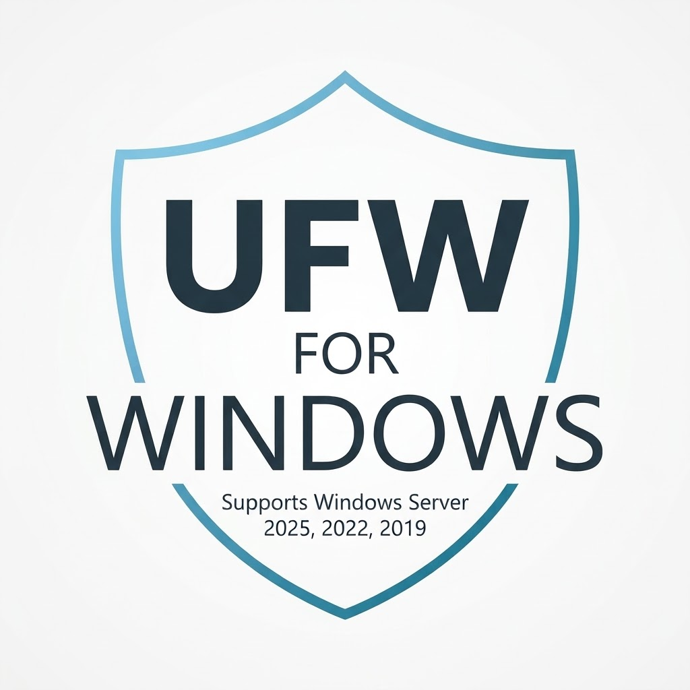

<p align="center">
  
</p>

# UFW for Windows Server (2019, 2022, 2025) & Windows 10 / 11

A lightweight, native CLI emulation of Linux **UFW (Uncomplicated Firewall)** for Windows Server, powered by Windows Defender Firewall cmdlets.

Manage your Windows Server firewall rules with the exact same simple and intuitive syntax you know and love from Ubuntu and Debian.

[](https://github.com/FAZZLofficial/UFW-For-Windows/releases)
[](LICENSE)
[](https://github.com/FAZZLofficial/UFW-For-Windows)

---

## 🚀 Installation & Uninstallation

### 1. GUI / Setup Installer
1. Download the latest `UFW-Windows-Setup-vX.X.X.exe` from [GitHub Releases](https://github.com/FAZZLofficial/UFW-For-Windows/releases).
2. Run the installer as Administrator.
3. The installer places the binaries in `C:\Program Files\UFW-Windows` and automatically registers it to the system-wide `PATH`.
4. Open any Command Prompt (`cmd.exe`) or PowerShell window and type `ufw`.

### 2. Unattended / Silent Installation (SysAdmins & Automation)
Deploy silently across multiple servers using standard flags:
```cmd
UFW-Windows-Setup-v2.0.0.exe /VERYSILENT /NORESTART
```

### 3. Clean Uninstallation
- Go to **Windows Settings > Apps > Installed apps** (or **Control Panel > Programs and Features**).
- Locate **UFW for Windows Server** and click **Uninstall**.
- The uninstaller safely cleans up files, removes the folder from the system `PATH`, and prompts whether to retain or purge created firewall rules (`UFW-*`).

---

## 🛠 Features & Syntax

### 1. Allow or Deny Ports
```powershell
# Open port on both TCP & UDP
ufw allow 25565

# Explicit protocol
ufw allow 80/tcp
ufw deny 445/tcp

# Port ranges
ufw allow 7000:7010/udp
```

### 2. Service Aliases
Common protocol names are automatically resolved to their standard ports:
```powershell
ufw allow ssh       # Port 22/tcp
ufw allow rdp       # Port 3389/tcp
ufw allow http      # Port 80/tcp
ufw allow https     # Port 443/tcp
ufw allow dns       # Port 53 (TCP/UDP)
ufw allow mysql     # Port 3306/tcp
ufw allow mssql     # Port 1433/tcp
ufw allow redis     # Port 6379/tcp
ufw allow postgres  # Port 5432/tcp
```

### 3. IP Filtering & Subnets (`from` / `to` / `proto`)
```powershell
# Allow SSH only from a specific IP address
ufw allow from 192.168.1.100 to any port 22 proto tcp

# Allow RDP access from an entire subnet
ufw allow from 10.0.0.0/24 to any port 3389 proto tcp

# Block a specific malicious IP entirely
ufw deny from 45.33.32.1
```

### 4. Status Overview & Delete by Index
```powershell
# Show active rules
ufw status

# Show rules with numeric IDs
ufw status numbered

# Delete a specific rule by its number
ufw delete 2

# Delete a rule by its definition
ufw delete allow 80/tcp
```

### 5. Firewall State & Default Policies
```powershell
# Turn firewall on / off
ufw enable
ufw disable

# Set default policies
ufw default deny incoming
ufw default allow outgoing

# Reset all UFW rules
ufw reset
```

---

## 🏗 Architecture & Technical Details

- **Native Windows Defender Integration:** Uses built-in `NetSecurity` PowerShell cmdlets under the hood (`New-NetFirewallRule`, `Get-NetFirewallRule`). No background services, daemons, or resource-heavy agents are required.
- **Rule Isolation:** Every rule created by this tool is prefixed with `UFW-` in the Windows Defender Firewall. Native system rules remain completely untouched and safe.
- **Speed:** Instant command-line execution through a lightweight `ufw.cmd` wrapper directly invoking the PowerShell logic.

## 📄 License

This project is licensed under the [GNU General Public License v3.0 (GPLv3)](LICENSE) - Copyright (c) 2026 FAZZL.
